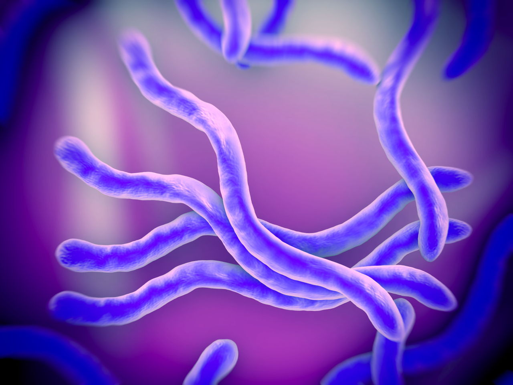

---
title: "Analysis" s
author: "Rain Zhu"
date: "12/02/2021" 
output: html_document 
--- 
#### [Rain's Github](https://github.com/JazzyRain/)

## Introduction 
##### In this assignment we will be investigating 3 different sequence of th 16S gene of [*Borrelia burgdorferi*](https://en.wikipedia.org/wiki/Borrelia_burgdorferi) which is a bacteria that causes Lyme Disease


# Data Setup
```{r setup, include=FALSE}
knitr::opts_chunk$set(echo = TRUE)
library(knitr)# load knitr 
library(dplyr)# load dplyr
```
## import excel data
```{r}
MyData<-read.csv("./Sequences.csv",header=T)#import Data
```

## Count the number of each nucleotide (A,T,C,G) of each sequence
```{r}

for (i in 1:length(MyData$Name)){ #set up for loop with entry matching "Name"
    nA<-nchar(gsub("[CGT]","\\1",MyData$Sequence)) # count the number of "A" in the ATCG sequence by eliminating CGT from content
    nG<-nchar(gsub("[CAT]","\\1",MyData$Sequence)) # count the number of "G" in the ATCG sequence by eliminating CAT from content
    nC<-nchar(gsub("[GAT]","\\1",MyData$Sequence)) # count the number of "C" in the ATCG sequence by eliminating GAT from content
    nT<-nchar(gsub("[CAG]","\\1",MyData$Sequence)) # count the number of "T" in the ATCG sequence by eliminating CAG from content
    GCcontent<-((nG+nC)/nchar(MyData$Sequence))*100 #find the percentage of GC content by adding total G and total C count divided by the total character multiply by 100
  if(i==">HQ433692.1 Borrelia burgdorferi strain QLZP1 16S ribosomal RNA gene, partial sequence"){ # if the correct Name is met, we will deposit the corresponding command
    print(MyData$Sequence[i])#print the respective sequence using [i]
    print(paste("A=",nA[i],"G=",nG[i],"C=",nC[i],"T=",nT[i])) #print the respective A,T,C,G count using [i]
  }
  if(i==">>HQ433694.1 Borrelia burgdorferi strain CS4 16S ribosomal RNA gene, partial sequence"){ # if the correct Name is met, we will deposit the corresponding command
    print(MyData$Sequence[i])#print the respective sequence using [i]
    print(paste("A=",nA[i],"G=",nG[i],"C=",nC[i],"T=",nT[i])) #print the respective A,T,C,G count using [i]
  }
    else{#we will use the else statement instead of another if satement to be more effient 
       print(MyData$Sequence[i])#print the respective sequence using [i]
       print(paste("A=",nA[i],"G=",nG[i],"C=",nC[i],"T=",nT[i])) #print the respective A,T,C,G count using [i]
    }
    MyData<-mutate(MyData, nA,nG,nC,nT,GCcontent)#save all for loop data into the dataframe 
}
```

## Graph setup 
```{r}
MyData<-rename(MyData,SequenceID=Name)# change the header "Name" to "SequenceID"
MyData$SequenceID<-gsub("[>]|[ Bor].*","",MyData$SequenceID)#within the SequenceID, all entry keeps only the ID, removing all other information 

MyData<-select(MyData,SequenceID,GCcontent)# before setting up a table, I made sure to only include SequenceID and GCcontent to fulfill the assignment requirement requirement 
kable(MyData)# kable() function is used to keep a neater loop, output table 

```
